# A股 Smart Beta 风格对照组 · 完整梳理

## Smart Beta 的含义

Smart Beta = 一种可投资的、规则化的因子溢价策略。
做多高暴露股票、做空低暴露股票，长期获取超越市场平均的系统性收益。

它不等于 Barra 因子。Barra 是风险分解工具，Smart Beta 是可投资的回报来源。
但 Barra 的很多因子恰好对应某个 Smart Beta 溢价，所以 Barra 数据可以直接服务于 Smart Beta 监控。

---

## 全市场 Smart Beta 风格对照组（按经济逻辑分类）

```mermaid
flowchart TB

    subgraph SB["A股 Smart Beta 风格对照组 · 全景"]
        direction TB

        subgraph VALUE["估值类 · 买便宜的"]
            V1["① 价值 vs 成长<br/>低PE/PB 减 高PE/PB<br/>经典 Fama-French HML<br/>经济逻辑: 风险补偿 + 过度外推"]
            V2["② 红利 vs 非红利<br/>高股息率 减 低/零股息<br/>经济逻辑: 确定性现金流溢价 + 机构偏好"]
        end

        subgraph SIZE_CAT["规模类 · 买小的"]
            S1["③ 小盘 vs 大盘<br/>小市值 减 大市值<br/>经济逻辑: 流动性补偿 + 成长空间<br/>⚠ 近年衰减, 需监控是否失效"]
        end

        subgraph RISK["风险类 · 买低风险的"]
            R1["④ 低波动 vs 高波动<br/>低历史波动率 减 高波动率<br/>经济逻辑: 彩票偏好(散户追涨杀跌)<br/>A股最强 Smart Beta 之一"]
            R2["⑤ 低贝塔 vs 高贝塔<br/>低市场贝塔 减 高贝塔<br/>经济逻辑: 杠杆约束 + 基准 hugging<br/>(与低波部分重叠但不完全一致)"]
        end

        subgraph MOM_CAT["动量类 · 买涨的/买跌够的"]
            M1["⑥ 动量 vs 静止<br/>近期赢家 减 近期输家<br/>经济逻辑: 反应不足 / 信息渐进扩散<br/>A股短期动量有效, 长期反转"]
            M2["⑦ 反转 vs 延续<br/>中期输家 减 中期赢家(长期窗口)<br/>经济逻辑: 过度反应修正<br/>A股散户主导, 反转效应很强"]
        end

        subgraph QUALITY["质量类 · 买好的"]
            Q1["⑧ 质量 vs 垃圾<br/>高ROE+低杠杆+盈利稳 减 相反<br/>经济逻辑: 护城河 + 持续经营能力<br/>Buffett 式 Smart Beta"]
            Q2["⑨ 盈利稳定 vs 盈利波动<br/>低盈余波动 减 高盈余波动<br/>经济逻辑: 确定性溢价<br/>(与质量高度相关但更聚焦)"]
        end

        subgraph CROWD["拥挤/情绪类 · 买没人要的"]
            C1["⑩ 低拥挤 vs 高拥挤<br/>低成交/低换手行业 减 高成交/高换手<br/>经济逻辑: 拥挤定价 → 均值回归<br/>⚠ 已有但可深化"]
            C2["⑪ 低关注 vs 高关注<br/>分析师覆盖少/机构持仓低 减 覆盖多/持仓高<br/>经济逻辑: 被忽视的溢价"]
        end

        subgraph MACRO["宏观敏感类 · 跟经济走的"]
            MC1["⑫ 周期 vs 防御<br/>有色/煤炭/钢铁 减 食品饮料/医药<br/>经济逻辑: 经济景气敏感度<br/>⚠ 已有"]
        end

        subgraph A_SPECIAL["A股特有 · 制度/结构类"]
            AS1["⑬ 国企 vs 民企<br/>央企/国企 减 民企<br/>经济逻辑: 改革红利 + 估值折价修复"]
            AS2["⑭ 北向重仓 vs 轻仓<br/>北上资金持仓比例高 减 低<br/>经济逻辑: 外资定价权 + 信息优势"]
        end
    end

    style VALUE fill:#0d1f2d,stroke:#3b82f6,color:#bfdbfe
    style SIZE_CAT fill:#0d1f2d,stroke:#3b82f6,color:#bfdbfe
    style RISK fill:#0d1f2d,stroke:#3b82f6,color:#bfdbfe
    style MOM_CAT fill:#0d1f2d,stroke:#3b82f6,color:#bfdbfe
    style QUALITY fill:#0d1f2d,stroke:#3b82f6,color:#bfdbfe
    style CROWD fill:#0d1f2d,stroke:#3b82f6,color:#bfdbfe
    style MACRO fill:#0d1f2d,stroke:#3b82f6,color:#bfdbfe
    style A_SPECIAL fill:#0d1f2d,stroke:#3b82f6,color:#bfdbfe
```



---

## 优先级排序

按 A股历史溢价强度 + PM 实战价值 + 与现有模块互补性 排序：

```
▬▬▬▬▬▬▬▬▬▬▬▬▬▬▬▬▬▬▬▬▬▬▬▬▬▬▬▬▬▬▬▬▬▬▬▬▬
🟢 第一梯队 — 必做 (溢价最强 + 最直接有用)
▬▬▬▬▬▬▬▬▬▬▬▬▬▬▬▬▬▬▬▬▬▬▬▬▬▬▬▬▬▬▬▬▬▬▬▬▬

① 红利 vs 非红利    ← A股最稳定的 Smart Beta，FOF 配置必看
   理由: 溢价持续性强、机构资金持续流入、PM每天都要判断红利风格方向
   数据: 申万红利指数 / 中证红利 vs 全市场 / Barra DIVYILD

④ 低波动 vs 高波动  ← A股最强异象
   理由: 散户彩票偏好导致低波溢价长期存在，公募 FOF 配置核心参考
   数据: 申万低贝/高贝 / Barra RESVOL

⑥ 动量 vs 静止     ← PM 选策略的第一判断
   理由: 动量延续=趋势策略可做, 动量为负=反转策略可做
   数据: Barra MOMENTUM + STREVRSL / 申万动量指数

⑧ 质量 vs 垃圾     ← 长期配置锚
   理由: ROE 选股是最底层的 Smart Beta，所有主动管理最后的锚
   数据: Barra EARNQLTY + PROFIT + INVSQLTY

▬▬▬▬▬▬▬▬▬▬▬▬▬▬▬▬▬▬▬▬▬▬▬▬▬▬▬▬▬▬▬▬▬▬▬▬▬
🟡 第二梯队 — 应做 (溢价强但更周期性)
▬▬▬▬▬▬▬▬▬▬▬▬▬▬▬▬▬▬▬▬▬▬▬▬▬▬▬▬▬▬▬▬▬▬▬▬▬

① 价值 vs 成长     ← 经典但需择时
⑦ 反转 vs 延续     ← A股散户主导,反转效应突出但需精准窗口
③ 小盘 vs 大盘     ← 历史溢价在衰减,需监控是否回归

▬▬▬▬▬▬▬▬▬▬▬▬▬▬▬▬▬▬▬▬▬▬▬▬▬▬▬▬▬▬▬▬▬▬▬▬▬
🔵 第三梯队 — 可做 (有溢价证据但更窄/更难分离)
▬▬▬▬▬▬▬▬▬▬▬▬▬▬▬▬▬▬▬▬▬▬▬▬▬▬▬▬▬▬▬▬▬▬▬▬▬

⑤ 低贝塔 vs 高贝塔 (与低波重叠度高，可先用低波)
⑨ 盈利稳定 vs 波动 (与质量高度重叠)
⑩ 低拥挤 vs 高拥挤 (已有基础, 后续深化)
⑪ 低关注 vs 高关注 (数据获取难度大)
⑬ 国企 vs 民企 (政治周期敏感, 不如前几个通用)
⑭ 北向重仓 vs 轻仓 (有趣但受外资流动扰动)
⑫ 周期 vs 防御 (已有)
```

---

## 推荐落地路线（7 个新增 Tab）

```
现有 4 Tab
  Tab 1: 周期 vs 防御      ✅
  Tab 2: 拥挤-反身性       ✅ (对应 ⑩)
  Tab 3: 风格轧差净值     ✅ (含红利/小盘的 proxy)
  Tab 4: 双创等权          ✅ (成长 proxy)

新增 7 Tab (按优先级)
  Tab 5: 红利 vs 非红利    ← 第一梯队 ①
  Tab 6: 低波 vs 高波动    ← 第一梯队 ④
  Tab 7: 动量 vs 静止      ← 第一梯队 ⑥
  Tab 8: 质量 vs 垃圾      ← 第一梯队 ⑧
  Tab 9: 价值 vs 成长      ← 第二梯队 ①
  Tab 10: 反转 vs 延续     ← 第二梯队 ⑦
  Tab 11: 小盘 vs 大盘     ← 第二梯队 ③ (纯规模)

每个 Tab = 净值曲线 + 多空日收益柱 + 近N日分位数 + 策略含义一句话
```

---

## Barra 因子与 Smart Beta 对照组的对应关系

```
Smart Beta           Barra 因子 (可直接用)
─────────────────────────────────────────
红利 vs 非红利       DIVYILD
低波 vs 高波动       RESVOL
低贝塔 vs 高贝塔     BETA
动量 vs 静止         MOMENTUM + STREVRSL
反转 vs 延续         LTREVRSL
价值 vs 成长         BTOP + EARNYILD / GROWTH
小盘 vs 大盘         SIZE + MIDCAP
质量 vs 垃圾         EARNQLTY + PROFIT + INVSQLTY
盈利稳定 vs 波动     EARNVAR
行业动量             INDMOM
─────────────────────────────────────────
已有(手工计算):
周期 vs 防御         申万行业分类
拥挤-反身性          手工(成交额+波动率)
```

---

## 为什么是这个顺序？

```
PM 每天问自己的问题                        → 对应的 Smart Beta Tab
──────────────────────────────────────────────────────────────
"今天是买分红票还是成长票？"               → 红利 vs 非红利
"市场在追涨还是在捡便宜？"                 → 低波 vs 高波动
"趋势在延续还是该反转了？"                 → 动量 vs 静止
"好公司跑赢垃圾公司了吗？"                 → 质量 vs 垃圾
"便宜的跑赢贵的了吗？"                     → 价值 vs 成长
"超跌反弹来了吗？"                         → 反转 vs 延续
"该买大票还是小票？"                       → 小盘 vs 大盘
```
