# A股 Smart Beta 风格对照组 · 完整梳理

## Smart Beta 的含义

Smart Beta = 一种可投资的、规则化的因子溢价策略。
做多高暴露股票、做空低暴露股票，长期获取超越市场平均的系统性收益。

它不等于 Barra 因子。Barra 是风险分解工具，Smart Beta 是可投资的回报来源。
但 Barra 的很多因子恰好对应某个 Smart Beta 溢价，所以 Barra 数据可以直接服务于 Smart Beta 监控。

---

## 全市场 Smart Beta 风格对照组（按经济逻辑分类）

```mermaid
flowchart TB

    subgraph SB["A股 Smart Beta 风格对照组 · 全景"]
        direction TB

        subgraph VALUE["估值类 · 买便宜的"]
            V1["① 价值 vs 成长<br/>低PE/PB 减 高PE/PB<br/>经典 Fama-French HML<br/>经济逻辑: 风险补偿 + 过度外推"]
            V2["② 红利 vs 非红利<br/>高股息率 减 低/零股息<br/>经济逻辑: 确定性现金流溢价 + 机构偏好"]
        end

        subgraph SIZE_CAT["规模类 · 买小的"]
            S1["③ 小盘 vs 大盘<br/>小市值 减 大市值<br/>经济逻辑: 流动性补偿 + 成长空间<br/>⚠ 近年衰减, 需监控是否失效"]
        end

        subgraph RISK["风险类 · 买低风险的"]
            R1["④ 低波动 vs 高波动<br/>低历史波动率 减 高波动率<br/>经济逻辑: 彩票偏好(散户追涨杀跌)<br/>A股最强 Smart Beta 之一"]
            R2["⑤ 低贝塔 vs 高贝塔<br/>低市场贝塔 减 高贝塔<br/>经济逻辑: 杠杆约束 + 基准 hugging<br/>(与低波部分重叠但不完全一致)"]
        end

        subgraph MOM_CAT["动量类 · 买涨的/买跌够的"]
            M1["⑥ 动量 vs 静止<br/>近期赢家 减 近期输家<br/>经济逻辑: 反应不足 / 信息渐进扩散<br/>A股短期动量有效, 长期反转"]
            M2["⑦ 反转 vs 延续<br/>中期输家 减 中期赢家(长期窗口)<br/>经济逻辑: 过度反应修正<br/>A股散户主导, 反转效应很强"]
        end

        subgraph QUALITY["质量类 · 买好的"]
            Q1["⑧ 质量 vs 垃圾<br/>高ROE+低杠杆+盈利稳 减 相反<br/>经济逻辑: 护城河 + 持续经营能力<br/>Buffett 式 Smart Beta"]
            Q2["⑨ 盈利稳定 vs 盈利波动<br/>低盈余波动 减 高盈余波动<br/>经济逻辑: 确定性溢价<br/>(与质量高度相关但更聚焦)"]
        end

        subgraph CROWD["拥挤/情绪类 · 买没人要的"]
            C1["⑩ 低拥挤 vs 高拥挤<br/>低成交/低换手行业 减 高成交/高换手<br/>经济逻辑: 拥挤定价 → 均值回归<br/>⚠ 已有但可深化"]
            C2["⑪ 低关注 vs 高关注<br/>分析师覆盖少/机构持仓低 减 覆盖多/持仓高<br/>经济逻辑: 被忽视的溢价"]
        end

        subgraph MACRO["宏观敏感类 · 跟经济走的"]
            MC1["⑫ 周期 vs 防御<br/>有色/煤炭/钢铁 减 食品饮料/医药<br/>经济逻辑: 经济景气敏感度<br/>⚠ 已有"]
        end

        subgraph A_SPECIAL["A股特有 · 制度/结构类"]
            AS1["⑬ 国企 vs 民企<br/>央企/国企 减 民企<br/>经济逻辑: 改革红利 + 估值折价修复"]
            AS2["⑭ 北向重仓 vs 轻仓<br/>北上资金持仓比例高 减 低<br/>经济逻辑: 外资定价权 + 信息优势"]
        end
    end

    style VALUE fill:#0d1f2d,stroke:#3b82f6,color:#bfdbfe
    style SIZE_CAT fill:#0d1f2d,stroke:#3b82f6,color:#bfdbfe
    style RISK fill:#0d1f2d,stroke:#3b82f6,color:#bfdbfe
    style MOM_CAT fill:#0d1f2d,stroke:#3b82f6,color:#bfdbfe
    style QUALITY fill:#0d1f2d,stroke:#3b82f6,color:#bfdbfe
    style CROWD fill:#0d1f2d,stroke:#3b82f6,color:#bfdbfe
    style MACRO fill:#0d1f2d,stroke:#3b82f6,color:#bfdbfe
    style A_SPECIAL fill:#0d1f2d,stroke:#3b82f6,color:#bfdbfe
```



---

## 优先级排序

按 A股历史溢价强度 + PM 实战价值 + 与现有模块互补性 排序：

```
▬▬▬▬▬▬▬▬▬▬▬▬▬▬▬▬▬▬▬▬▬▬▬▬▬▬▬▬▬▬▬▬▬▬▬▬▬
🟢 第一梯队 — 必做 (溢价最强 + 最直接有用)
▬▬▬▬▬▬▬▬▬▬▬▬▬▬▬▬▬▬▬▬▬▬▬▬▬▬▬▬▬▬▬▬▬▬▬▬▬

① 红利 vs 非红利    ← A股最稳定的 Smart Beta，FOF 配置必看
   理由: 溢价持续性强、机构资金持续流入、PM每天都要判断红利风格方向
   数据: 申万红利指数 / 中证红利 vs 全市场 / Barra DIVYILD

④ 低波动 vs 高波动  ← A股最强异象
   理由: 散户彩票偏好导致低波溢价长期存在，公募 FOF 配置核心参考
   数据: 申万低贝/高贝 / Barra RESVOL

⑥ 动量 vs 静止     ← PM 选策略的第一判断
   理由: 动量延续=趋势策略可做, 动量为负=反转策略可做
   数据: Barra MOMENTUM + STREVRSL / 申万动量指数

⑧ 质量 vs 垃圾     ← 长期配置锚
   理由: ROE 选股是最底层的 Smart Beta，所有主动管理最后的锚
   数据: Barra EARNQLTY + PROFIT + INVSQLTY

▬▬▬▬▬▬▬▬▬▬▬▬▬▬▬▬▬▬▬▬▬▬▬▬▬▬▬▬▬▬▬▬▬▬▬▬▬
🟡 第二梯队 — 应做 (溢价强但更周期性)
▬▬▬▬▬▬▬▬▬▬▬▬▬▬▬▬▬▬▬▬▬▬▬▬▬▬▬▬▬▬▬▬▬▬▬▬▬

① 价值 vs 成长     ← 经典但需择时
⑦ 反转 vs 延续     ← A股散户主导,反转效应突出但需精准窗口
③ 小盘 vs 大盘     ← 历史溢价在衰减,需监控是否回归

▬▬▬▬▬▬▬▬▬▬▬▬▬▬▬▬▬▬▬▬▬▬▬▬▬▬▬▬▬▬▬▬▬▬▬▬▬
🔵 第三梯队 — 可做 (有溢价证据但更窄/更难分离)
▬▬▬▬▬▬▬▬▬▬▬▬▬▬▬▬▬▬▬▬▬▬▬▬▬▬▬▬▬▬▬▬▬▬▬▬▬

⑤ 低贝塔 vs 高贝塔 (与低波重叠度高，可先用低波)
⑨ 盈利稳定 vs 波动 (与质量高度重叠)
⑩ 低拥挤 vs 高拥挤 (已有基础, 后续深化)
⑪ 低关注 vs 高关注 (数据获取难度大)
⑬ 国企 vs 民企 (政治周期敏感, 不如前几个通用)
⑭ 北向重仓 vs 轻仓 (有趣但受外资流动扰动)
⑫ 周期 vs 防御 (已有)
```

---

---

## 各 Smart Beta 算法

### ① 红利 vs 非红利

```
数据源:  申万红利指数(801031) / 中证红利(000922) vs 万得全A(881001)
         Barra DIVYILD 因子收益率(替代)

构建:
  Method A: 红利指数收益率 - 万得全A收益率 = 日超额
            → 累计净值 = ∏(1+日超额)
  Method B: Barra DIVYILD 因子累计收益率(高股息-低股息)
            → 直接等于 Smart Beta 多空净值

信号:
  近20日累计超额 > 0  → 红利占优
  近20日累计超额 < 0  → 非红利占优
  z-score(60日超额) > 2 → 红利过热, 注意反转
```

### ② 低波动 vs 高波动

```
数据源:  Barra RESVOL 因子收益率
         (申万低贝/高贝指数 801811/801812)

构建:
  全市场个股按过去60日波动率排序
  Top 20% = 低波组 / Bot 20% = 高波组
  日收益率 = 低波组等权收益 - 高波组等权收益
  累计净值 = ∏(1+日收益率)

  简化: 直接用 Barra RESVOL 因子累计收益率

信号:
  RESVOL 累计净值持续上行 → 低波占优(风险厌恶)
  RESVOL 累计净值回撤       → 高波占优(追逐弹性)
  RESVOL 收益 z-score > 2   → 低波拥挤
```

### ③ 小盘 vs 大盘

```
数据源:  Barra SIZE + MIDCAP 因子收益率
         中证2000 vs 沪深300

构建:
  全市场个股按总市值排序
  Top 20% = 大盘组 / Bot 20% = 小盘组
  日收益率 = 小盘组等权收益 - 大盘组等权收益
  累计净值 = ∏(1+日收益率)

  简化: 中证2000日收益率 - 沪深300日收益率
        Barra SIZE 因子累计收益率(小盘-大盘溢价强度)

信号:
  规模溢价强度和方向
  近3年累计是否仍在衰减
  小盘因子拥挤度(用 exposure 集中度)
```

### ④ 低贝塔 vs 高贝塔

```
数据源:  Barra BETA 因子收益率
         (与 RESVOL 部分重叠但统计口径不同)

构建:
  全市场个股按过去252日市场贝塔排序
  Top 20% = 高贝塔组 / Bot 20% = 低贝塔组
  日收益率 = 低贝塔组等权收益 - 高贝塔组等权收益
  累计净值 = ∏(1+日收益率)

  简化: 直接用 Barra BETA 因子累计收益率取反

信号:
  BETA 因子为负 → 低贝塔溢价(市场偏防御)
  BETA 因子为正 → 高贝塔溢价(市场进攻)
  与 RESVOL 信号做一致性校验:
    两者同向 → 信号可信
    两者背离 → 需注意(贝塔包含方向性,波动率是纯波动)
```

### ⑤ 价值 vs 成长

```
数据源:  Barra BTOP + EARNYILD = 价值端
         申万高PE/低PE指数(801211/801221)
         Barra GROWTH = 成长端

构建:
  Method A(指数):
    申万低PE指数收益率 - 申万高PE指数收益率
    → 累计多空净值

  Method B(Barra):
    价值因子收益 = mean(BTOP因子收益, EARNYILD因子收益)
    日超额 = 价值因子收益 - GROWTH因子收益
    → 累计 = ∏(1+日超额)

信号:
  价值-成长超额 > 0 且扩大 → 价值占优(防守/再平衡)
  价值-成长超额 < 0 且扩大 → 成长占优(进攻/产业趋势)
  近60日超额 z-score > 2   → 单边过热
```

### ⑥ 动量 vs 静止

```
数据源:  Barra MOMENTUM + STREVRSL + INDMOM

构建:
  动量综合因子 = mean(MOMENTUM, INDMOM, -STREVRSL)
  其中 STREVRSL 取反(短期反转因子取反 = 短期动量)
  
  日收益率 = 动量综合因子日收益
  累计净值 = ∏(1+日收益率)

  分拆: MOMENTUM 累计(中期动量)
        STREVRSL 累计(短期, 取反=动量)
        INDMOM 累计(行业动量)

信号:
  动量累计净值上行 → 趋势延续, 追涨策略有效
  动量累计净值下行 → 趋势断裂, 反转策略有效
  MOMENTUM vs STREVRSL(未取反)的滚动相关:
    正相关 → 短中长动量共振 → 趋势强
    负相关 → 多时间尺度分歧 → 震荡市
```

### ⑦ 反转 vs 延续

```
数据源:  Barra LTREVRSL(长期反转)
         = 过去3年输家 - 过去3年赢家

构建:
  LTREVRSL 日收益率直接使用
  累计净值 = ∏(1+日收益率)

  分拆: 短期反转 = STREVRSL(原始, 不取反)
        长期反转 = LTREVRSL
        → 短期反转信号快但噪音大, 长期反转慢但可靠

信号:
  LTREVRSL 为正 → "跌够了弹回来", 反转有效
  LTREVRSL 为负 → 强者恒强, 反转失效

  组合信号(动量+反转):
    MOM ↑ + STREV ↑(取反) + LTREV ↓ → 最强趋势
    MOM ↓ + STREV ↓(取反) + LTREV ↑ → 最强反转
    三者方向混乱 → 市场无方向
```

### ⑧ 质量 vs 垃圾

```
数据源:  Barra EARNQLTY + PROFIT + INVSQLTY

构建:
  EPS质量得分: EARNQLTY 因子 = 低应计-高应计
  盈利得分:    PROFIT  因子 = 高ROE-低ROE
  投资得分:    INVSQLTY 因子 = 低资本支出-高资本支出

  质量综合因子 = mean(EARNQLTY, PROFIT, INVSQLTY)
  日收益率 = 质量综合因子日收益
  累计净值 = ∏(1+日收益率)

  分拆显示三个子因子各自累计净值以看哪个在驱动

信号:
  质量因子上行 → 好公司溢价(Buffett 模式)
  质量因子下行 → 垃圾股溢价(投机模式)
  三个子因子方向一致 → 信号可信
  三个子因子撕裂 → 信号存疑
```

### ⑨ 盈利稳定 vs 盈利波动

```
数据源:  Barra EARNVAR

构建:
  EARNVAR = 低盈余波动 - 高盈余波动
  日收益率 = EARNVAR 因子日收益
  累计净值 = ∏(1+日收益率)

  与质量因子的相关性:
    r(EARNVAR, Quality综合) → 通常 >0.6
    如果 r 突然下降 → 说明稳定性和盈利能力在脱钩

信号:
  EARNVAR 为正 → 稳定公司溢价
  EARNVAR 为负 → 波动公司溢价(通常是周期/困境反转)"
```

### ⑩ 低拥挤 vs 高拥挤

```
数据源:  申万行业日行情 + 行业成交额
         (已有基础, 以下为深化算法)

构建:
  原始(已有):
    31个申万一级行业按: 成交额×波动率 排序
    Top 6 = 高拥挤 / Bot 6 = 低拥挤
    日超额 = 低拥挤等权收益 - 高拥挤等权收益

  深化:
    加 HHI 指数:
      每个行业在全市场成交额占比的平方和
      HHI = Σ(行业成交额/全市场成交额)²
      HHI 上升 → 资金集中在少数行业 → 结构拥挤
    加拥挤度反转概率:
      过去拥挤阈值突破后 20日反转概率
      = 历史样本中"拥挤>阈值 → 此后20日反转"的比例

信号:
  低拥挤-高拥挤超额 > 0 → "没人要的反倒涨了"
  低拥挤-高拥挤超额 < 0 → "抱团还在延续"
  HHI > 历史80%分位 → 结构性拥挤预警
```

### ⑪ 低关注 vs 高关注

```
数据源:  分析师覆盖次数(Wind/Choice获取)
         机构持仓比例(季报推算)

构建:
  全市场个股按:
    score = 分析师覆盖数(-) + 机构持仓%(-)
    Top 20% = 高关注 / Bot 20% = 低关注
  
  日超额 = 低关注组等权收益 - 高关注组等权收益
  月度调仓(因为机构持仓按季报)

  注意: 数据频率低, 更适合月度监控而非日频

信号:
  低关注-高关注超额 > 0 → "被忽视的涨了"
  低关注-高关注超额 < 0 → "机构抱团抱对了"
```

### ⑫ 周期 vs 防御

```
数据源:  申万行业分类
         (已有)

构建(已有):
  周期: 有色(801050) / 煤炭(801021) / 钢铁(801040)
  防御: 食品饮料(801120) / 医药生物(801150)
  日超额 = 周期等权收益 - 防御等权收益
  累计净值 = ∏(1+日超额)

信号:
  周期-防御超额 > 0 → 周期占优(经济复苏)
  周期-防御超额 < 0 → 防御占优(经济下行)
```

### ⑬ 国企 vs 民企

```
数据源:  申万央企/国企系列指数
         或个股属性筛选

构建:
  全市场按企业属性分为: 央企+地方国企 / 民企
  日超额 = 国企组等权收益 - 民企组等权收益
  累计净值 = ∏(1+日超额)

  分拆: 央企 vs 民企
        地方国企 vs 民企
        → 看是央企改革驱动还是其他

信号:
  国企超额 > 0 且扩大 → 国企改革/中特估驱动
  国企超额 < 0       → 民企弹性占优
```

### ⑭ 北向重仓 vs 轻仓

```
数据源:  北上资金持仓数据(日频)
         或 Barra COUNTRY 因子(外资敞口 proxy)

构建:
  全市场按北上资金持仓占流通市值排序
  Top 20% = 外资重仓 / Bot 20% = 外资轻仓
  日超额 = 外资重仓组等权收益 - 外资轻仓组等权收益
  累计净值 = ∏(1+日超额)

信号:
  外资重仓超额 > 0 → 外资定价权有效, 跟外资买
  外资重仓超额 < 0 → 外资跑输, 北向非领先指标
  与北向累计净流入做交叉:
    北向流入 + 重仓超额 < 0 → 外资买但涨不动 = 减量信号
```

---

## 各 Smart Beta 数据源汇总

```
Smart Beta           首选数据           备选数据             频率
────────────────────────────────────────────────────────────
红利 vs 非红利       申万红利指数        Barra DIVYILD         日
低波 vs 高波动       Barra RESVOL        申万低贝/高贝          日
小盘 vs 大盘         Barra SIZE+MIDCAP   中证2000-沪深300      日
低贝塔 vs 高贝塔     Barra BETA          申万低贝/高贝          日
价值 vs 成长         Barra BTOP+EARNYILD / GROWTH    申万高/低PE  日
动量 vs 静止         Barra MOMENTUM+STREVRSL+INDMOM  —         日
反转 vs 延续         Barra LTREVRSL      —                    日
质量 vs 垃圾         Barra EARNQLTY+PROFIT+INVSQTY  —         日
盈利稳定 vs 波动     Barra EARNVAR       —                    日
低拥挤 vs 高拥挤     手工(成交额+波动率) —                    日
低关注 vs 高关注     分析师覆盖          机构持仓              月/季
周期 vs 防御         申万行业分类        —                    日
国企 vs 民企         企业属性/申万国企    —                    日
北向重仓 vs 轻仓     北上资金持仓        Barra COUNTRY         日
```

---

## 推荐落地路线（7 个新增 Tab）

```
现有 4 Tab
  Tab 1: 周期 vs 防御      ✅
  Tab 2: 拥挤-反身性       ✅ (对应 ⑩)
  Tab 3: 风格轧差净值     ✅ (含红利/小盘的 proxy)
  Tab 4: 双创等权          ✅ (成长 proxy)

新增 7 Tab (按优先级)
  Tab 5: 红利 vs 非红利    ← 第一梯队 ①
  Tab 6: 低波 vs 高波动    ← 第一梯队 ④
  Tab 7: 动量 vs 静止      ← 第一梯队 ⑥
  Tab 8: 质量 vs 垃圾      ← 第一梯队 ⑧
  Tab 9: 价值 vs 成长      ← 第二梯队 ①
  Tab 10: 反转 vs 延续     ← 第二梯队 ⑦
  Tab 11: 小盘 vs 大盘     ← 第二梯队 ③ (纯规模)

每个 Tab = 净值曲线 + 多空日收益柱 + 近N日分位数 + 策略含义一句话
```

---

## Barra 因子与 Smart Beta 对照组的对应关系

```
Smart Beta           Barra 因子 (可直接用)
─────────────────────────────────────────
红利 vs 非红利       DIVYILD
低波 vs 高波动       RESVOL
低贝塔 vs 高贝塔     BETA
动量 vs 静止         MOMENTUM + STREVRSL
反转 vs 延续         LTREVRSL
价值 vs 成长         BTOP + EARNYILD / GROWTH
小盘 vs 大盘         SIZE + MIDCAP
质量 vs 垃圾         EARNQLTY + PROFIT + INVSQLTY
盈利稳定 vs 波动     EARNVAR
行业动量             INDMOM
─────────────────────────────────────────
已有(手工计算):
周期 vs 防御         申万行业分类
拥挤-反身性          手工(成交额+波动率)
```

---

## 为什么是这个顺序？

```
PM 每天问自己的问题                        → 对应的 Smart Beta Tab
──────────────────────────────────────────────────────────────
"今天是买分红票还是成长票？"               → 红利 vs 非红利
"市场在追涨还是在捡便宜？"                 → 低波 vs 高波动
"趋势在延续还是该反转了？"                 → 动量 vs 静止
"好公司跑赢垃圾公司了吗？"                 → 质量 vs 垃圾
"便宜的跑赢贵的了吗？"                     → 价值 vs 成长
"超跌反弹来了吗？"                         → 反转 vs 延续
"该买大票还是小票？"                       → 小盘 vs 大盘
```
