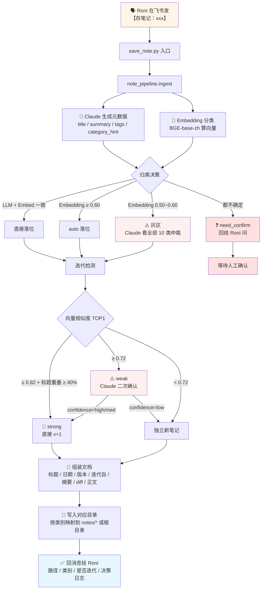
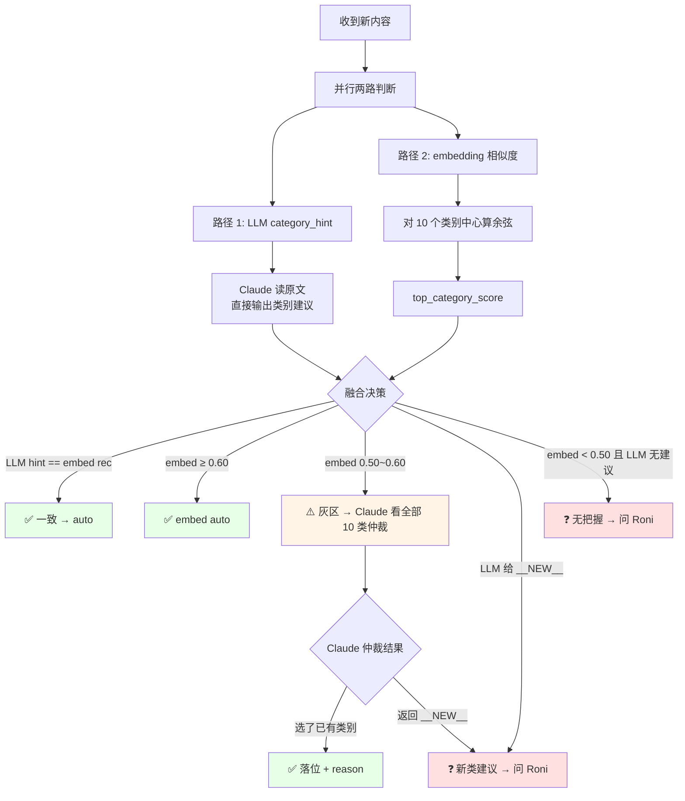
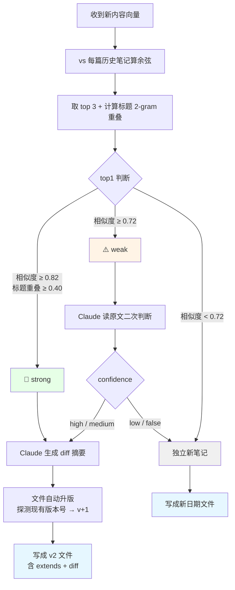
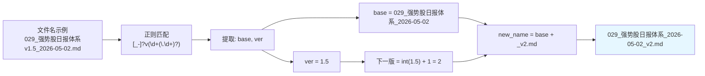
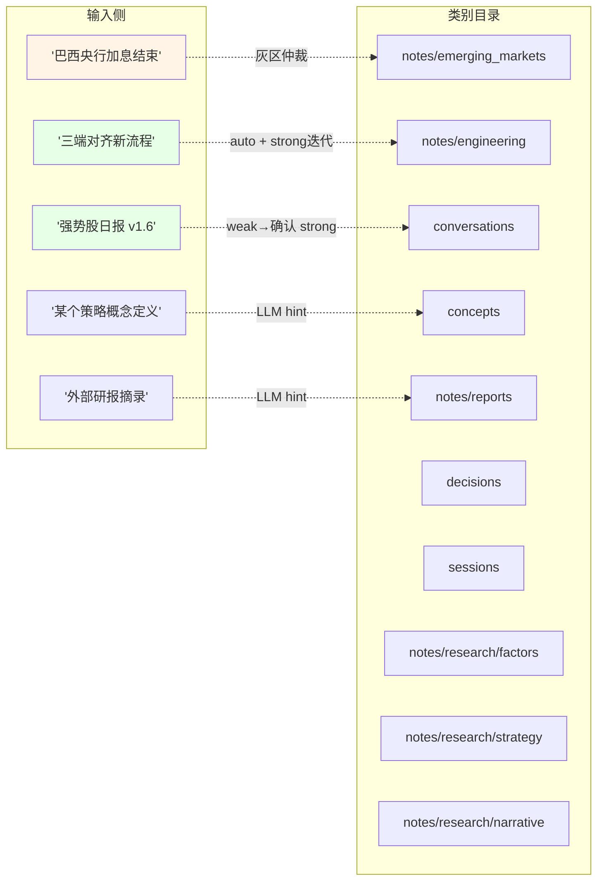
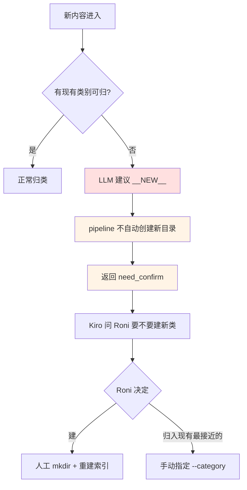
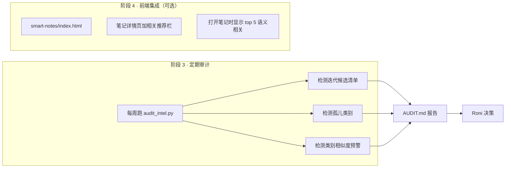

# Smart Notes 智能分类系统流程图

**日期**: 2026-05-05
**类型**: 决策 / 架构
**标签**: #smart-notes #embedding #llm #架构图 #流程图

---

## 看板关联

- 关联模块：Smart Notes（`~/Desktop/gamt-dashboard/smart-notes/`）
- 实现位置：`smart-notes/intelligence/`
- 关联笔记：`2026-05-05_GAMT架构梳理与对客逻辑缺口诊断.md`

---

## 整体流程（主干）



---

## 归类决策细节



---

## 迭代决策细节



---

## 版本号探测逻辑



---

## 10 个类别归属示例



---

## 模型分工

| 层 | 模型 | 位置 | 作用 | 成本 |
|----|------|------|------|------|
| L1 向量化 | BGE-base-zh-v1.5 | 本地（ModelScope 下载） | 文本 → 768 维向量 | 零 |
| L1 相似度 | numpy 余弦 | 本地 | 归类 + 迭代候选 | 零 |
| L2 生成 | Claude Opus 4.7 | aicanapi-47 中转 | 标题 / 摘要 / 标签 | ~¥0.01/次 |
| L2 仲裁 | Claude Opus 4.7 | 同上 | 灰区归类兜底 | ~¥0.01/次 |
| L2 diff | Claude Opus 4.7 | 同上 | v1 vs v2 变化摘要 | ~¥0.02/次 |

**单篇笔记总成本：** 约 ¥0.02~0.05（最多 3 次 Claude 调用）

---

## 文件结构

```
smart-notes/intelligence/
├── notes_intel.py          # L1 层：扫描 / 向量化 / embedding 分类
├── llm_client.py           # L2 层：Claude API 封装
├── note_pipeline.py        # 核心 ingest() 编排
├── save_note.py            # CLI + 飞书入口
├── note_vectors.json       # 向量库（86 篇，~2MB）
├── category_centers.json   # 9 个类别中心（~200KB）
└── README.md
```

---

## 防分类膨胀机制



---

## 未来扩展（阶段 3 - 未启动）



---

## 关键设计决策（和记忆）

1. **本地 BGE + 云端 Claude 混合**：Claude 没 embedding 能力，相似度匹配不需要 LLM，两者配合成本/效果最优

2. **ModelScope 下载模型**：Hugging Face 直连不稳，代理也挂了，国内走 ModelScope 镜像站 1 分钟到手

3. **Homebrew Python 装依赖的正解**：`pip3 install --user --break-system-packages`（--user 隔离到 `~/Library/Python/3.14/`，不污染系统）

4. **防分类膨胀的三重保险**：
   - 不自动创建新目录
   - 灰区 prompt 强调"优先现有类别（含空类）"
   - 版本探测支持 `v1.5` 这种非整数版本号

5. **触发方式：Roni 说「存笔记：...」→ 我调 save_note.py**
   - 已写入 MEMORY.md 作为长期识别规则
   - 加「预览一下 / dry run」走 `--dry` 不落地

---

## 对话溯源

本次系统设计源于 Roni 的三个连环问题：

1. **"关键字没命中但有关联怎么办？"** → embedding 余弦相似度
2. **"怎么识别版本迭代？"** → embedding + 标题重叠 + Claude diff 三重判断
3. **"整个 Smart Notes 能不能更聪明？"** → L1 检索层 + L2 生成层的分层架构

Roni 原本以为本地模型"没有泛化能力"，澄清后确认：
- embedding 不需要 LLM 的推理能力，需要的是**语义相似度判断**
- 真正需要泛化的部分（摘要/仲裁/diff）交给 Claude
- 两者组合 = 快 + 聪明 + 便宜
